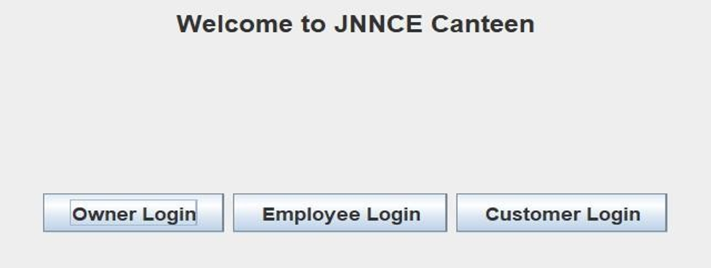
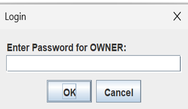
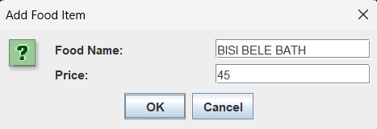
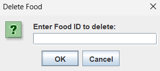
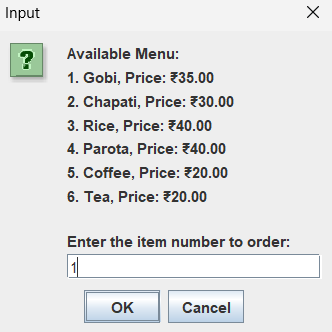
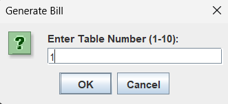
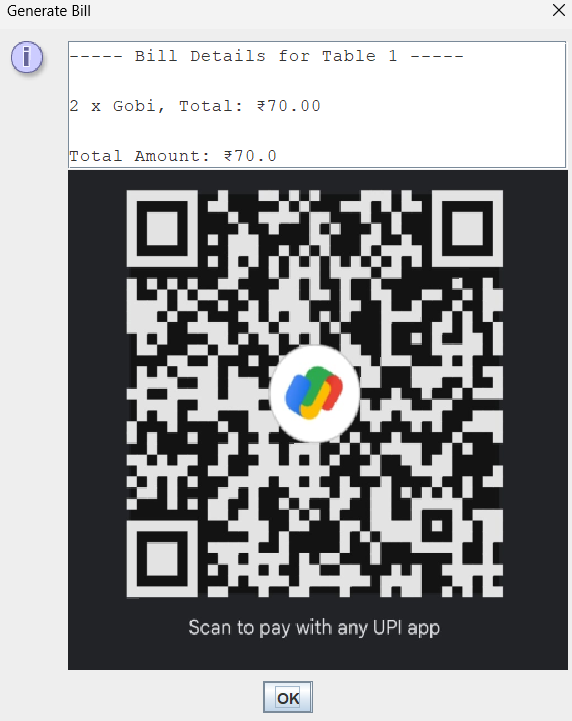

# 🍽️ Canteen Management System

A **Java-based Canteen Management System** developed to simplify canteen operations by managing food items, customer orders, employee management, and bill generation. The application uses **Java**, **JDBC**, and **MySQL** for efficient data management.

---

## 📖 Project Overview

The Canteen Management System is a desktop application designed to automate daily canteen activities. It provides separate functionalities for administrators, employees, and customers, making food ordering and billing faster and more organized.

---

## ✨ Features

* 🔐 User Login
* 👨‍💼 Employee Management
* 🍔 View Food Menu
* 🛒 Order Food
* ➕ Add Food Items
* ❌ Delete Food Items
* 💵 Generate Bill
* 📄 Display Final Bill
* 💳 QR Code Payment Support
* 🗄️ MySQL Database Integration

---

## 🛠️ Technologies Used

| Technology          | Purpose                 |
| ------------------- | ----------------------- |
| Java                | Application Development |
| JDBC                | Database Connectivity   |
| MySQL               | Database                |
| MySQL Connector JAR | JDBC Driver             |

---

## 📂 Project Structure

```text
canteen-management-system/
│
├── lib/
│   └── mysql-connector-java-8.0.26.jar
│
├── screenshots/
│   ├── login.png
│   ├── owner-login.png
│   ├── add-food-item.png
│   ├── delete-food.png
│   ├── ordering-food.png
│   ├── generate-bill.png
│   ├── bill.png
│   └── final-bill.png
│
├── CanteenItem.java
├── CanteenManagement.java
├── ConsoleUtil.java
├── Customer.java
├── DatabaseConnection.java
├── Employee.java
├── EmployeeManagement.java
├── Login.java
├── Store.java
├── TextUtils.java
├── jnnce_canteen.sql
├── qr_code.jpg
├── README.md
└── .gitignore
```

---

# 📸 Application Screenshots

## 🔐 Login Screen



---

## 👨‍💼 Owner Login



---

## ➕ Add Food Item



---

## ❌ Delete Food Item



---

## 🍔 Ordering Food



---

## 💵 Generate Bill



---

## 🧾 Bill


---

## 📄 Final Bill



---

# ⚙️ Installation

### 1. Clone the repository

```bash
git clone https://github.com/ashwinipai01/canteen-management-system.git
```

### 2. Open the project

Open the project using:

* Eclipse
* IntelliJ IDEA
* VS Code

### 3. Import Database

Import:

```
jnnce_canteen.sql
```

into MySQL.

### 4. Configure Database

Update your MySQL username and password in:

```
DatabaseConnection.java
```

### 5. Add JDBC Driver

Add the MySQL Connector JAR located inside the **lib** folder to your project's build path.

### 6. Run the Application

Execute:

```
CanteenManagement.java
```

---

# 🚀 Future Enhancements

* 🌐 Web-based Interface
* 📱 Mobile Application
* 📊 Sales Analytics Dashboard
* 📦 Inventory Management
* 💳 Online Payment Gateway
* 👤 Role-Based Authentication

---

# 👩‍💻 Author

**Ashwini G Pai**

📧 Email: [ashwinipai052@gmail.com](mailto:ashwinipai052@gmail.com)

🐙 GitHub: https://github.com/ashwinipai01

💼 LinkedIn: https://www.linkedin.com/in/ashwini-g-pai-723162215

---

# ⭐ Support

If you found this project useful, consider giving it a **⭐ Star** on GitHub.

It helps others discover the project and motivates further improvements.

---

## 📜 License

This project is developed for educational purposes and learning.
